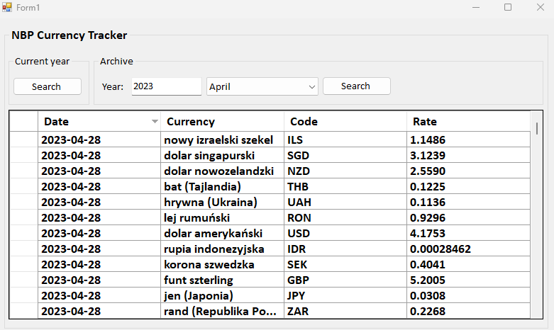

# NBP Currency Tracker WinForms App

NBP Currency Tracker is a Windows Forms application that retrieves and displays exchange rates from the National Bank of Poland (NBP) API. Users can view both current and historical exchange rates in an easy-to-use interface.

## Features

- Retrieve current exchange rates from NBP,
- Retrieve historical exchange rates from a specific year and month,
- Interactive UI,
- Data display,
- Error handling – Handles API errors and incorrect user input,
- Modern Code Structure – Implements Single Responsibility Principle (SRP) and clean architecture.

## Tech stack

- **C# .NET WinForms**,
- **HTTP Client (HttpClient) for API calls**
- **JSON (Newtonsoft.Json)**.
- **Separation of Concerns (SRP)**

 
 

  

